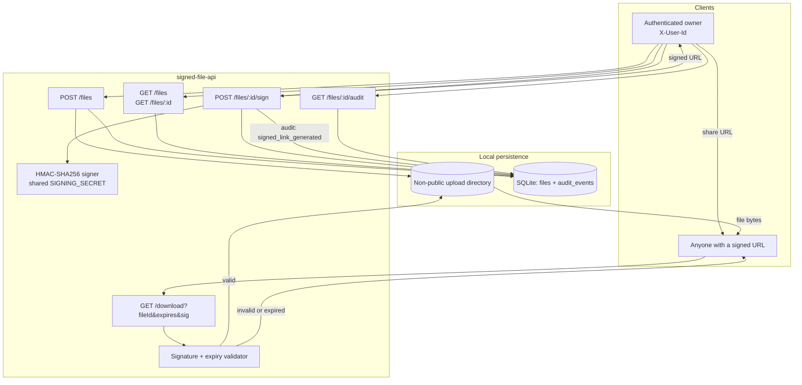

# Architecture: Signed File API

High-level request lifecycle and data flow for private uploads and cryptographically signed downloads.

## Lifecycle notes

1. **Upload** — Multipart bytes land only under the configured non-public `UPLOAD_DIR`. Metadata (owner, filename, size, content type, path) is written to SQLite.
2. **Sign** — Owners request a TTL. The service HMAC-signs `fileId.expiresAt` with `SIGNING_SECRET` and records an audit event. No server-side token store is required, so links remain valid across restarts.
3. **Download** — Public endpoint recomputes the HMAC, checks expiry with a timing-safe compare, then streams the private blob if valid.
4. **Metadata / audit** — Owners can list files and inspect signed-link generation history for a given file.
