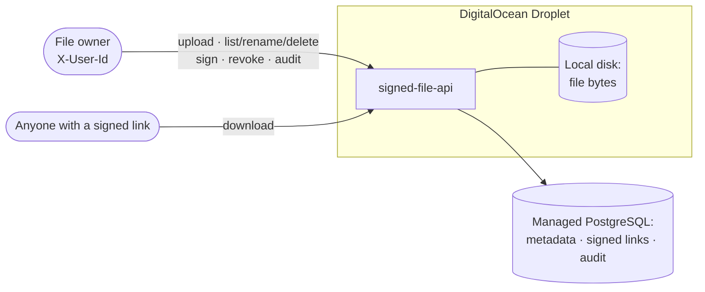
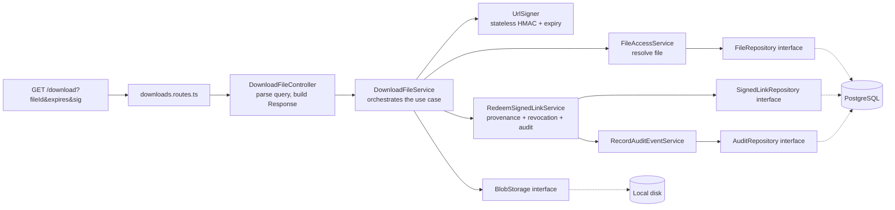
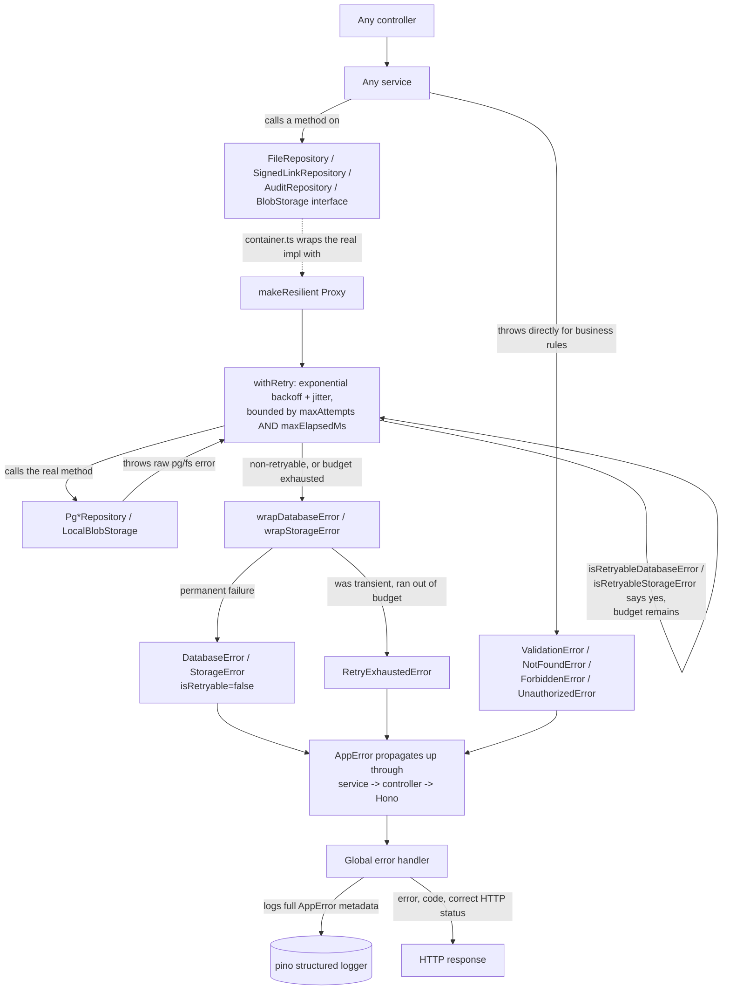
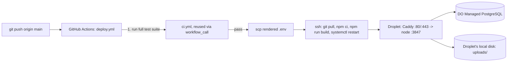
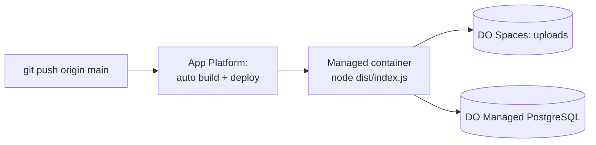
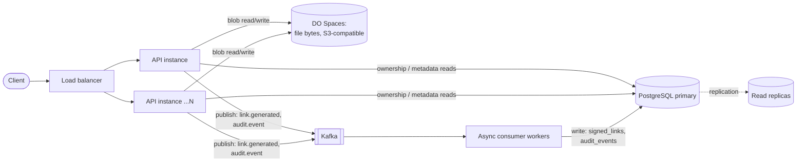

# Architecture: Signed File API

High-level view of who talks to what. Every API call — upload, list/rename/delete, sign, revoke, audit, or a public download — reduces to the same shape: a client hits the API running on the Droplet, which reads/writes file bytes on local disk and metadata/links/audit in Managed PostgreSQL.

The [request-by-request lifecycle](#lifecycle-notes) below fills in what each call actually does; the [layered request flow](#layered-request-flow-controller--service--repository) and [exceptions/retries](#exceptions-logging-and-retries) sections after that show the internal structure for engineers extending the service. See [Scalability & future architecture](#scalability--future-architecture) for how this evolves under load.

## Lifecycle notes

1. **Upload** — Multipart bytes land only under the configured non-public `UPLOAD_DIR` on local disk. Metadata (owner, filename, size, content type, path) is written to the `files` table in Postgres. `POST /files/batch` does the same for multiple files in one request, uploading each independently so one bad file (empty, too large) doesn't fail the rest.
2. **Metadata & lifecycle** — Owners can list (`GET /files`), fetch (`GET /files/:id`), rename (`PATCH /files/:id`), and delete (`DELETE /files/:id`, or `POST /files/batch-delete` for many) files scoped strictly to their `X-User-Id`. Delete removes the blob from disk and the `files` row (cascading its `signed_links`), but preserves a `file_deleted` audit event with a metadata snapshot of what was removed.
3. **Sign** — Owner requests a TTL for a `fileId`. The service derives an HMAC-SHA256 signature over `fileId.expiresAt` using `SIGNING_SECRET`, then persists the signature, TTL, and expiry in the `signed_links` table and records a `signed_link_generated` audit event. Because the signature is a pure function of `(fileId, expiresAt, secret)`, it can always be recomputed and re-verified even if the process restarts.
4. **Download** — Public endpoint runs two checks in order:
   - **Stateless crypto check**: recompute the HMAC and check expiry — rejects tampered or expired links instantly without a database round trip.
   - **Postgres check**: confirm a matching `signed_links` row exists and `revoked_at IS NULL` — this is what makes revocation possible and confirms the link was actually issued by this service (not just well-formed).
   Every attempt (success or rejection) writes an audit event.
5. **Link management** — Owners can list all signed links ever generated for a file (`GET /files/:id/links`) with status (`active`/`revoked`) and revoke any active link before its natural expiry (`POST /files/:id/links/:linkId/revoke`).
6. **Audit** — `GET /files/:id/audit` returns the full event history: generation, successful downloads, rejected downloads, revocations, renames, and deletes. Audit events have **no foreign key to `files`**, by design — an audit trail must remain queryable after the resource it describes is gone.

## Layered request flow (Controller → Service → Repository)

Every endpoint follows the same path through the layers. Signed-link download is shown here as an example:

- **Controllers** only translate HTTP to and from a service call.
- **Services** hold one use case each, and depend on repository and storage **interfaces**, not concrete implementations.
- **Repositories** own the SQL for a single table.
- `container.ts` is the composition root. It binds each interface to its implementation (`Pg*Repository`, `LocalBlobStorage`), so a different backend such as DigitalOcean Spaces means adding an implementation without editing any service.

## Exceptions, logging, and retries

Every custom exception — whatever layer it's thrown from — shares one base, `AppError`: a `code`, an HTTP `statusCode`, an `isRetryable` flag, structured `context`, and (via `Error.cause`) the original low-level failure. That uniformity is what lets the single global error handler log every failure the same way and always return a consistent `{ error, code }` body, regardless of whether the root cause was a validation rule, an ownership check, a dropped Postgres connection, or a busy filesystem handle.

Retrying happens once, generically, at the repository/storage boundary — not scattered through service code — via a `Proxy` (`makeResilient`) that `container.ts` wraps around every `Pg*Repository` and the `BlobStorage`. This is the boundary where "client-to-service call during file creation and storage" (writing the blob, inserting the `files` row) and "persisting to the DB" (every other repository call) actually happen, so it covers both cases the same way without each service needing its own retry logic.

## Metrics & configurability

### What's built

**Metrics** (`src/infrastructure/metrics/metrics.ts`, `prom-client`): a single `Registry`, exposed as standard Prometheus text at `GET /metrics`, with four application-specific instruments layered on top of Node's default process metrics:

| Metric | Labels | Recorded from |
|---|---|---|
| `http_requests_total` / `http_request_duration_seconds` | `method`, `route` (pattern, not literal path), `status_code` | `common/middleware/metrics-middleware.ts`, wrapping every request |
| `service_errors_total` | `layer` (`domain`/`database`/`storage`/`unknown`), `code`, `retryable` | `error-handler.ts`, the one place every `AppError` (and everything else) passes through |
| `retry_attempts_total` / `retry_exhausted_total` | `operation` (e.g. `FileRepository.insert`) | `with-retry.ts`, alongside the existing structured log lines |

The deliberate choice here was **Prometheus text format, not a vendor SDK call**. Nothing in the application code knows or cares whether the eventual backend is self-hosted Prometheus, the Datadog Agent's OpenMetrics/Prometheus check, Grafana Cloud, or anything else that can scrape an HTTP endpoint — migrating later is a scrape-config change on the infrastructure side, not an application redeploy.

**API documentation**: every endpoint is described in a hand-authored OpenAPI 3.0 document (`src/docs/openapi.ts`), served raw at `GET /openapi.json` and as an interactive Swagger UI at `GET /docs` — request/response schemas, required headers, and status codes for the full surface, always in sync with the code because it's part of the same PR review as any route change.

**Configurability** (`src/config/env.ts`): every environment-driven or otherwise-tunable value — server binding, signing secret, TTL ceiling, upload/batch limits, log level, retry policy (attempts/delays/elapsed budget), and the storage backend selector — is defined once, zod-validated, and typed. Nothing else in the codebase reads `process.env` directly, and `STORAGE_BACKEND=local|spaces` is itself a configurability example: swapping deployment targets (Droplet vs. App Platform) is an environment variable, not a code change.

### Future plans

- **Wire a real scrape target.** `/metrics` exists and is correct today, but nothing is actually pulling from it yet. The next step is pointing either a self-hosted Prometheus + Grafana stack or the Datadog Agent's Prometheus check at the Droplet (or each App Platform instance), then building the first dashboard and alert rule directly from `service_errors_total{layer="database"}` — the metric this whole design was built to make possible.
- **Alerting and ticketing on the signals already emitted.** Once scraped, the natural alerts are: error-rate-by-layer above a threshold over N minutes (paging), `retry_exhausted_total` incrementing at all (early warning of a degrading dependency before it becomes a full outage), and p99 `http_request_duration_seconds` regressions per route. Routing those into a ticketing system (PagerDuty, Opsgenie, or a Datadog monitor → Jira/Linear integration) is the next concrete step once there's a real on-call rotation to route them to.
- **Request-scoped correlation IDs.** Logs and metrics are correlated by route and error code today, but not by an individual request — adding a generated `X-Request-Id` (or honoring an inbound one) threaded through the logger's child-logger context would make "find every log line for this one failed request" possible without grepping by timestamp.
- **Dynamic config reload for a few specific keys.** Everything in `config/env.ts` currently requires a restart to change. Most of it should — a signing secret or a storage backend change deserves a deliberate redeploy — but a couple (log level, retry policy tuning) are the kind of thing an on-call engineer might want to adjust live during an incident without a full deploy cycle.

## Why Postgres instead of only stateless HMAC verification

The signature alone is enough to prove a link *could* have come from this service, but storing the generated link in Postgres adds real product value beyond cryptographic proof:

- **Revocation** — an owner can invalidate a leaked link immediately, without waiting for TTL expiry or rotating the shared secret (which would invalidate every other outstanding link too).
- **Auditability** — "list every link ever generated for this file" and "list every download attempt" are only possible with a persisted record.
- **Restart safety is preserved** — Postgres, like the HMAC secret, is durable across process restarts, so this doesn't reintroduce the in-memory-state problem the signing scheme was designed to avoid.

## Deployment (DigitalOcean)

Two supported targets. Same application code and Postgres schema either way — `STORAGE_BACKEND` is the only thing that changes.

### Option A: Droplet + local disk (default)

- **File bytes** (`UPLOAD_DIR`) stay on local disk on the Droplet — this needs a Droplet with a persistent volume, not App Platform's ephemeral filesystem or a multi-instance deployment.
- **Metadata, signed links, and audit events** live in a DigitalOcean **Managed PostgreSQL** cluster — same `DATABASE_URL`-driven config as local dev, no code changes.
- **Caddy** terminates TLS (automatic, once a domain is pointed at the Droplet) and reverse-proxies to the app, which only listens on `127.0.0.1`; the DO Firewall exposes just 22/80/443.
- See [`infra/README.md`](../infra/README.md) for the exact provisioning and deploy commands, and `.github/workflows/deploy.yml` for the CI/CD pipeline (test → verify-droplet → verify-database → deploy) that gates every deploy.

### Option B: App Platform + Spaces (alternative)

- **App Platform** builds and runs the container itself — no Droplet to patch, and it can raise `instance_count` as traffic grows without any infrastructure change on your part.
- Its filesystem is ephemeral, so `STORAGE_BACKEND=spaces` is required — file bytes go to a DO Spaces bucket via `SpacesBlobStorage` (`src/infrastructure/storage/spaces-blob-storage.ts`) instead of local disk. This is also what makes it safe to run more than one instance: any instance can serve any file.
- Deploys itself on every push to `main` (`deploy_on_push: true` in the app spec) — no separate GitHub Actions workflow for this target.
- See [`infra/app-platform/README.md`](../infra/app-platform/README.md) for the exact provisioning commands.

### Which one to use

The Droplet is the default because it needs no external object-storage account and matches "store it in a non-public directory on the local file system" most directly for a single-instance deployment. App Platform + Spaces is the better choice once horizontal scaling actually matters — see the next section.

## Scalability & future architecture

Horizontal scaling of the API is already solved — that's exactly what App Platform + `SpacesBlobStorage` (Option B above) gets you today: statelessness via object storage instead of local disk, any instance serving any file. What's left is the database side: **every request still pays for a synchronous Postgres write** even for things that don't need to block the response (audit logging, link-generation bookkeeping), and there's no read-scaling or data-retention story yet for a table that grows unboundedly.

**Decouple writes from the request path with Kafka.** Generating a signed link and recording an audit event are both writes that don't need to complete before the API responds. Publishing `link.generated` / `audit.event` to Kafka and letting async consumer workers persist them to Postgres means a spike in link-generation or audit-heavy traffic gets absorbed by the topic's backlog instead of directly hammering the database's write throughput or slowing down the request. The `/download` path's revocation check still needs a synchronous read, so it stays as-is — this is specifically for the write-heavy, latency-insensitive side.

**Scale PostgreSQL two ways.** Vertically (a bigger Managed Database tier) is the first lever and needs zero application changes. Horizontally, read replicas offload the read-heavy paths (listing files, fetching metadata, ownership checks) from the primary, which then only has to handle writes. For the `audit_events` table specifically — the one table that grows unboundedly — range-partitioning by `created_at` (e.g. monthly partitions) keeps individual indexes small and makes retention (dropping old partitions) cheap compared to `DELETE` at scale.

**Add alpha/beta environments to CI/CD.** Right now `main` deploys straight to production once tests pass. The natural next step is `alpha` → `beta` → `production` as separate environments (Droplets, or App Platform apps), each gated by the same test suite plus its own integration-test coverage report, so a regression surfaces in alpha traffic before it reaches real users — the same tests, staged, not new ones.
