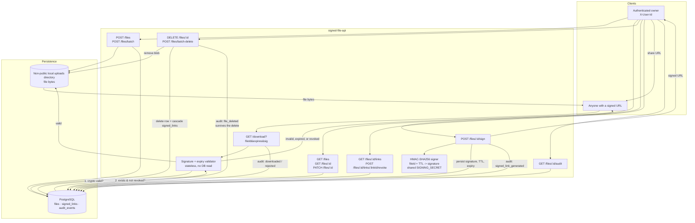

# Architecture: Signed File API

High-level request lifecycle and data flow for private uploads and cryptographically signed downloads.

## Lifecycle notes

1. **Upload** — Multipart bytes land only under the configured non-public `UPLOAD_DIR` on local disk. Metadata (owner, filename, size, content type, path) is written to the `files` table in Postgres. `POST /files/batch` does the same for multiple files in one request, uploading each independently so one bad file (empty, too large) doesn't fail the rest.
2. **Metadata & lifecycle** — Owners can list (`GET /files`), fetch (`GET /files/:id`), rename (`PATCH /files/:id`), and delete (`DELETE /files/:id`, or `POST /files/batch-delete` for many) files scoped strictly to their `X-User-Id`. Delete removes the blob from disk and the `files` row (cascading its `signed_links`), but preserves a `file_deleted` audit event with a metadata snapshot of what was removed.
3. **Sign** — Owner requests a TTL for a `fileId`. The service derives an HMAC-SHA256 signature over `fileId.expiresAt` using `SIGNING_SECRET`, then persists the signature, TTL, and expiry in the `signed_links` table and records a `signed_link_generated` audit event. Because the signature is a pure function of `(fileId, expiresAt, secret)`, it can always be recomputed and re-verified even if the process restarts.
4. **Download** — Public endpoint runs two checks in order:
   - **Stateless crypto check**: recompute the HMAC and check expiry — rejects tampered or expired links instantly without a database round trip.
   - **Postgres check**: confirm a matching `signed_links` row exists and `revoked_at IS NULL` — this is what makes revocation possible and confirms the link was actually issued by this service (not just well-formed).
   Every attempt (success or rejection) writes an audit event.
5. **Link management** — Owners can list all signed links ever generated for a file (`GET /files/:id/links`) with status (`active`/`revoked`) and revoke any active link before its natural expiry (`POST /files/:id/links/:linkId/revoke`).
6. **Audit** — `GET /files/:id/audit` returns the full event history: generation, successful downloads, rejected downloads, revocations, renames, and deletes. Audit events have **no foreign key to `files`**, by design — an audit trail must remain queryable after the resource it describes is gone.

## Why Postgres instead of only stateless HMAC verification

The signature alone is enough to prove a link *could* have come from this service, but storing the generated link in Postgres adds real product value beyond cryptographic proof:

- **Revocation** — an owner can invalidate a leaked link immediately, without waiting for TTL expiry or rotating the shared secret (which would invalidate every other outstanding link too).
- **Auditability** — "list every link ever generated for this file" and "list every download attempt" are only possible with a persisted record.
- **Restart safety is preserved** — Postgres, like the HMAC secret, is durable across process restarts, so this doesn't reintroduce the in-memory-state problem the signing scheme was designed to avoid.

## Deployment note (DigitalOcean)

- File bytes (`UPLOAD_DIR`) stay on local disk — this fits a single **Droplet** with a persistent volume. It intentionally would **not** survive on App Platform's ephemeral filesystem or a multi-instance deployment without moving blobs to DO Spaces.
- Metadata, signed links, and audit events live in **Postgres** — this can be a Droplet-hosted instance for the exercise, or a DigitalOcean **Managed PostgreSQL** cluster in production, without any application code changes (just `DATABASE_URL`).
